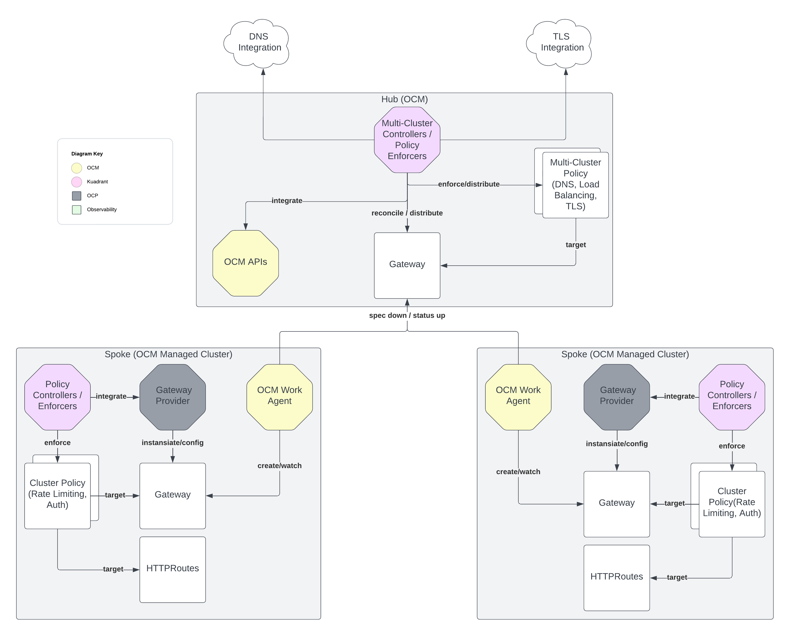
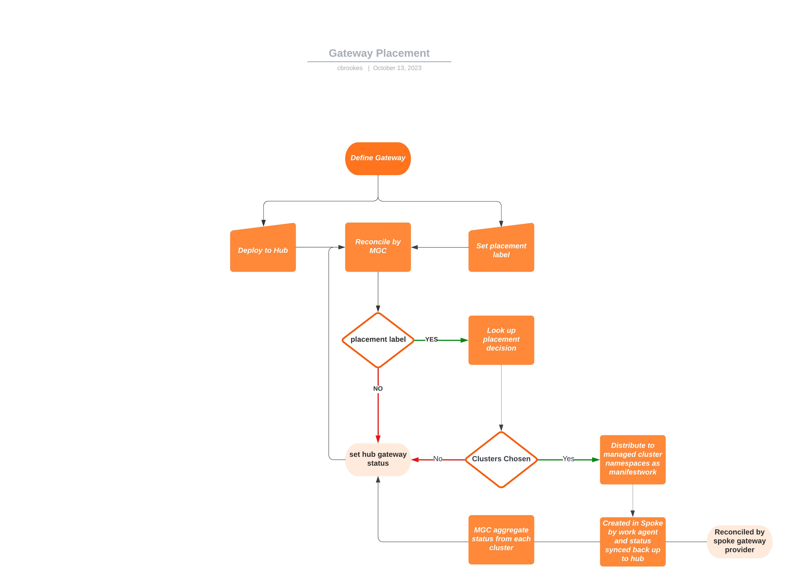
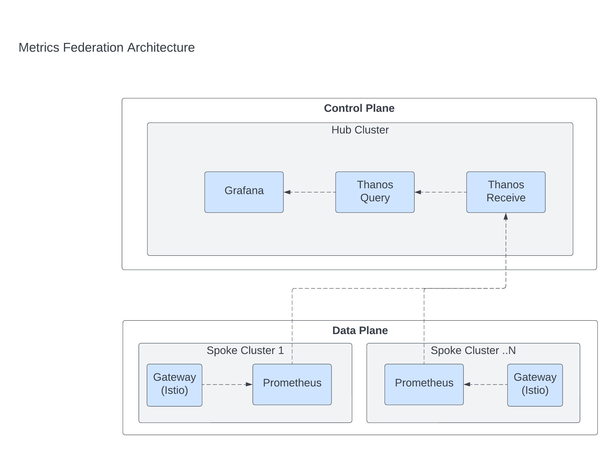

# Kuadrant Architectural Overview [Draft]

<!--- variables for repeated links --->
[AuthPolicy]: https://docs.kuadrant.io/kuadrant-operator/doc/auth/
[RateLimitPolicy]: https://docs.kuadrant.io/kuadrant-operator/doc/rate-limiting/
[TLSPolicy]: https://github.com/Kuadrant/multicluster-gateway-controller/blob/main/docs/reference/tlspolicy.md
[DNSPolicy]: https://github.com/Kuadrant/multicluster-gateway-controller/blob/main/docs/reference/dnspolicy.md

## Overview

It is important to note that Kuadrant is not in itself a gateway provider. Kuadrant provides a set of valuable policy APIs that enhance [Gateway API](https://github.com/kubernetes-sigs/gateway-api) via its defined [policy attachment](https://gateway-api.sigs.k8s.io/references/policy-attachment/) extension point. The policy APIs are reconciled by a set of policy controllers and enforced via integration at different points to configure, enhance and secure the application connectivity provided via Gateway API and the underlying gateway provider. 
These policy extensions are focused around areas such as DNS management supporting global load balancing and health checks, alongside service protection specific APIs such as rate limiting and auth. Kuadrant also integrates with [Open Cluster Management](https://open-cluster-management.io/) as a multi-cluster control plane to enable defining and distributing Gateways across multiple clusters, providing load balancing and tls management for these distributed gateways. These integrations and features can be managed centrally in a declarative way from the Open Cluster Management Hub using Kubernetes resources.

## Key Architectural Areas

* The Kuadrant architecture is spread across a control plane and also a data plane. Kuadrant can work in both a single and multi-cluster context. 
Currently in order for all APIs to work in a single or multi-cluster context you need to have Open Cluster Management installed.  While this may change in the future, this approach allows us to start with a single cluster and seamlessly scale as more clusters are added.
* The control plane is where policies are exposed and expressed as kubernetes APIs and reconciled by the Kuadrant policy controllers. 
* The data plane is where Kuadrant's service protection components, configured by the  control plane policies, are enforced within the gateway instance as part of the request flow. 

## 1000m Architecture

### Control Plane Components and Responsibilities
A control plane component is something responsible for accepting instruction via a CRD based API and ensuring that configuration is manifested into state that can be acted on.

#### [Kuadrant Operator](https://github.com/Kuadrant/Kuadrant-operator)
* Installation of data plane service protection components via their respective operators
* Exposes [`RateLimitPolicy`][RateLimitPolicy] and [`AuthPolicy`][AuthPolicy] and is currently the policy controller for these APIs
* Configures the Gateway to be able to leverage the data plane service protection components
#### [Multi-Cluster Gateway Controller](https://github.com/Kuadrant/multicluster-gateway-controller)
* Exposes [`DNSPolicy`][DNSPolicy] and [`TLSPolicy`][TLSPolicy]
* Configures DNS providers (e.g AWS Route 53) and TLS providers
* Focused around use cases involving distributed gateways (for example across clouds or geographic regions)
* Integrates with Open Cluster Management as the multi-cluster management hub to distribute and observe gateway status based on the clusters they are deployed to. Works directly with Open Cluster Management APIs such [`PlacementDecision`](https://open-cluster-management.io/concepts/placement/#placementdecisions) and [`ManifestWork`](https://open-cluster-management.io/concepts/manifestwork/).
#### [Kuadrant-add-on-manager](https://github.com/Kuadrant/multicluster-gateway-controller/tree/main/cmd/ocm)
* Sub component in the gateway controller repository
* Follows the [add-on pattern](https://open-cluster-management.io/concepts/addon/) from Open Cluster Management
* Responsible for configuring and installing Kuadrant into a target spoke cluster

#### [Limitador Operator:](https://github.com/Kuadrant/limitador-operator)
* Installs and configures Limitador
#### [Authorino Operator:](https://github.com/Kuadrant/authorino-operator)
* Installs and configures Authorino

### Data Plane Components and Responsibilities
A data plane component sits in the request flow and is responsible for enforcing policy and providing service protection capabilities based on configuration managed and created by the control plane.

#### [Limitador](https://github.com/Kuadrant/limitador)
* Complies with the with Envoy rate limiting API to provide rate limiting to the gateway
#### [Authorino](https://github.com/Kuadrant/authorino)
* Complies with the Envoy external auth API to provide auth integration to the gateway
#### [WASM Shim](https://github.com/Kuadrant/wasm-shim)
* Uses the [Proxy WASM ABI Spec](https://github.com/proxy-wasm/spec) to integrate with Envoy and provide filtering and connectivity to Limitador for request time enforcement of and rate limiting

### Dependencies and integrations

In order to provide its full suite of functionality, Kuadrant has several dependencies. Some of these are optional depending on the functionality needed.

#### [Cert-Manager](https://cert-manager.io/): **Required**
* Provides TLS integration
* Used by [`TLSPolicy`][TLSPolicy] and [Authorino](https://github.com/Kuadrant/authorino).
#### [Open Cluster Manager](https://open-cluster-management.io/): **Required**
* Provides a multi-cluster control plane to enable the defining and distributing of Gateways across multiple clusters.
#### [Istio](https://istio.io): **Required**
* Gateway API provider that Kuadrant integrates with via WASM and Istio APIS to provide service protection capabilities.
* Used by [`RateLimitPolicy`][RateLimitPolicy] and [`AuthPolicy`][AuthPolicy]
#### [Gateway API](https://github.com/kubernetes-sigs/gateway-api): **Required**
* New standard for Ingress from the Kubernetes community
* Gateway API is the core API that Kuadrant integrates with.
#### [Thanos/Prometheus/Grafana](https://thanos.io): **Optional**
* Provides observability integration
* Rather than providing any Kuadrant specific observability tooling, we instead look to leverage existing tools and technologies to provide observability capabilities for ingress. 

## High Level Multi-Cluster Architecture

Kuadrant has a multi-cluster gateway controller that is intended to run in a Open Cluster Management provided "Hub" cluster. This cluster is effectively a central management cluster where policy and gateways along with all that Open Cluster Management offers can be defined and distributed to the managed "spoke" clusters. 

## Single cluster 
In a single cluster context, the overall architecture remains the same as above, the key difference is that the Hub and Spoke cluster are now a single cluster rather than multiple clusters. This is how we are initially supporting single cluster.

## How does Kuadrant leverage Open Cluster Management?

Kuadrant deploys a multi-cluster gateway controller into the Open Cluster Management hub (a control plane that manages a set of "spoke" clusters where workloads are executed). This controller offers its own APIs but also integrates with hub CRD based APIs (such as the placement API) along with the Gateway API CRD based APIs in order to provide multi-cluster Gateway capabilities to the hub and distribute actual gateway instances to the spokes. See the Open Cluster Management [docs](https://open-cluster-management.io/concepts/architecture/#hub-spoke-architecture) for further details on the hub spoke architecture.

As part of installing Kuadrant, the Gateway API CRDs are also installed into the hub cluster and Kuadrant defines a standard Gateway API [`GatewayClass`](https://gateway-api.sigs.k8s.io/api-types/gatewayclass/) resource that the multi-cluster gateway controller is the chosen controller for. 

Once installed, an Open Cluster Management user can then (with the correct RBAC in place) define in the standard way a [Gateway resource](https://gateway-api.sigs.k8s.io/api-types/gateway/) that inherits from the Kuadrant configured `GatewayClass` in the hub. There is nothing unique about this Gateway definition, the difference is what it represents and how it is used. This Gateway is used to represent a "multi-cluster" distributed gateway. As such there are no pods running behind this Gateway instance in the hub cluster, instead it serves as a template that the Kuadrant multi-cluster gateway controller reconciles and distributes to targeted spoke clusters.  It leverages the Open Cluster Management APIs to distribute these gateways (more info below) and aggregates the status information from each spoke cluster instance of this gateway back to this central definition, in doing this it can represent the status of the gateway across multiple clusters but also use that information to integrate with DNS providers etc.

### Gateway Deployment and Distribution

In order for a multi-cluster gateway to be truly useful, it needs to be distributed or "placed" on a specific set of hub managed spoke clusters.  Open Cluster Management is responsible for a set of placement and replication APIs. Kuadrant is aware of these APIs, and so when a given gateway is chosen to be placed on a set of managed clusters, Kuadrant multi-cluster gateway controller will ensure the right resources ([`ManifestWork`](https://open-cluster-management.io/concepts/manifestwork/)) are created in the correct namespaces in the hub. Open Cluster Management then is responsible for syncing these to the actual spoke cluster and reporting back the status of these resources to the Hub. A user would indicate which clusters they want a gateway placed on by using a [`Placement`](https://open-cluster-management.io/concepts/placement/) and then labeling the gateway using the `cluster.open-cluster-management.io/placement` label.

In order for the Gateway to be instantiated, we need to know what underlying gateway provider is being used on the spoke clusters. Admins can then set this provider in the hub via the GatewayClass params. In the hub, Kuadrant will then apply a transformation to the gateway to ensure when synced it references this spoke gateway provider (Istio for example). 

It is the Open Cluster Management workagent that is responsible for syncing down and applying the resources into the managed spoke cluster. It is also responsible for syncing status information back to the hub. It is the multi-cluster gateway controller that is responsible for aggregating this status.

The status information reported back to the Hub is used by the multi-cluster gateway controller to know what LB hosts / IPAddresses to use for DNSRecords that it creates and manages.

More info on the Open Cluster Management hub and spoke architecture can be found [here](https://open-cluster-management.io/concepts/architecture/)

## How does Kuadrant integrate with Gateway Providers?

Currently the Kuadrant data plane only integrates with an Istio based gateway provider:

* It registers Authorino with the [`IstioOperator`](https://istio.io/latest/docs/reference/config/istio.operator.v1alpha1/#IstioOperatorSpec) as an auth provider so that Authorino can be used as an external auth provider.
* It leverages an [`EnvoyFilter`](https://istio.io/latest/docs/reference/config/networking/envoy-filter/) to register the rate limiting service as an upstream service.
* Based on the Kuadrant [`AuthPolicy`][AuthPolicy], it leverages Istio's [`AuthorizationPolicy`](https://istio.io/latest/docs/reference/config/security/authorization-policy/) resource to configure when a request should trigger Authorino to be called for a given host, path and method etc. 
* It provides a WebAssembly (WASM) Plugin that conforms to the [Proxy WASM ABI](https://github.com/proxy-wasm/spec) (application binary interface). This WASM Plugin is loaded into the underlying Envoy based gateway provider and configured via the Kuadrant Operator based on defined [`RateLimitPolicy`][RateLimitPolicy] resources. This binary is executed in response to a HTTP request being accepted by the gateway via the underlying Envoy instance that provides the proxy layer for the Gateway (IE Envoy). This plugin is configured with the correct upstream rate limit service name and when it sees a request, based on the provided configuration, it will trigger a call to the installed Limitador that is providing the rate limit capabilities and either allow the request to continue or trigger a response to the client with a 429 (too many requests) HTTP code.

### Data Flows

There are several different data flows when using Kuadrant. 

#### Control plane configuration and status reporting

The initial creation of these APIs (gateways, policies etc) is done by the relevant persona in the control plane just as they would any other k8s resource. We use the term cluster admin or gateway admin as the operations type persona configuring, and placing gateways. 
As shown above, in a multi-cluster configuration. API definitions are pulled from the Hub and "manifested" into the spokes. The Status of those synced resources are reported back to the Hub. The same happens for a single cluster, the only difference being the work agent hub controllers are all installed on one cluster.

#### Third party enforcement and Integration

In order to enforce the policy configuration, components in the control plane and data plane can reach out to configured 3rd parties such as cloud based DNS provider, TLS providers and Auth providers.

#### Request Flow

Requests coming through the gateway instance can be sent to Limitador based on configuration of the WASM plugin installed into the Envoy based gateway provider or to Authorino based configuration provided by the Istio [`AuthorizationPolicy`](https://istio.io/latest/docs/reference/config/security/authorization-policy/). 
Each of these components have the capability to see the request and need to in order to make the required decision. Each of these components can also prevent the request from reaching its intended backend destination based on user configuration. 

## Auth

As all of the APIs are CRDs, auth around creating these resources is handled in the standard way IE by the kubernetes cluster and RBAC. There is no relationship by default between the Auth features provided by Authorino to application developers and the auth requirements of the cluster API server.

For Auth between Spoke and Hub see Open Cluster Management [docs](https://open-cluster-management.io/concepts/architecture/)

### Observability

Kuadrant doesn't provide any specific observability components, but rather provides a reference setup using well known and established components along with some useful dashboards to help observe key things around the Gateways. The focus of this setup, is in the context of a multi-cluster setup where Open Cluster Management is installed and gateways are being defined and distributed from that hub.

## Some notes on future direction

This section is here to provide some insight into architectural changes that may be seen in the near future:

What is in this doc represents the architecture at point our MVP release. Below are some areas that we have identified that are likely to change in the coming releases. As these happen, this doc will also evolve.

* We want to separate out the ocm integration into its own controller so that policies can evolve without a coupling to any one multi-cluster management solution
* We want to separate the policies into their own controller that is capable of supporting both single (without Open Cluster Management) and multi-cluster (with Open Cluster Management enabled) contexts, so that the barrier to entry is reduced for those starting with a single cluster
* We want to allow for an on cluster DNS Provider such as CoreDNS so that we can provide an implementation that is disconnected from any cloud provider and provides more flexible DNS setups.
* We will look to reduce our integration with Istio and want to provide integration with additional gateway providers such as EnvoyGateway