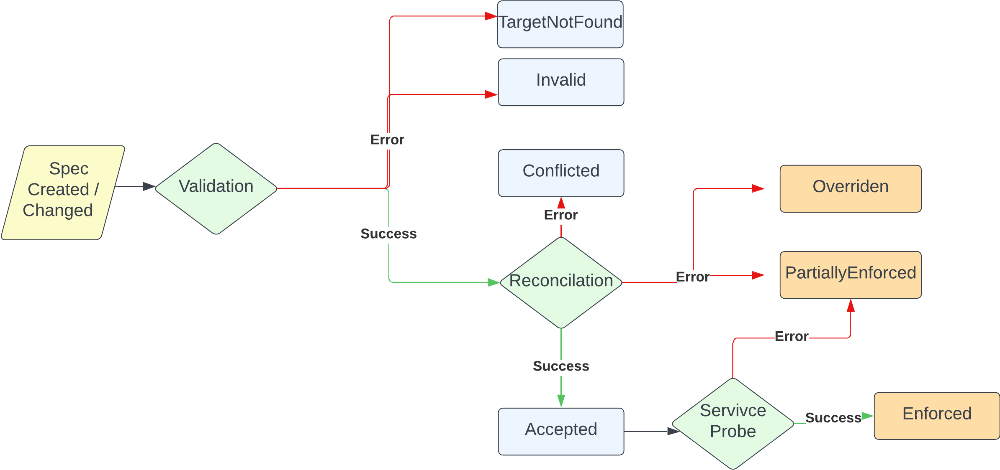
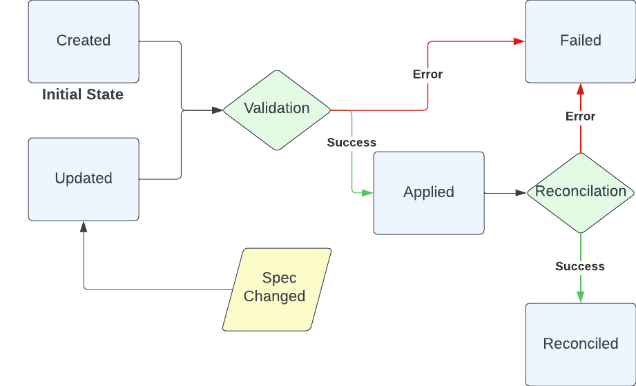

# Policy Status

- Feature Name: `policy_status_states`
- Start Date: 2023-02-03
- RFC PR: [Kuadrant/architecture#0009](https://github.com/Kuadrant/architecture/pull/9)
- Issue tracking: [Kuadrant/architecture#0038](https://github.com/Kuadrant/architecture/issues/38)

# Summary
[summary]: #summary

This RFC proposes a new design for any Kuadrant Policy (`RateLimitPolicy`, `AuthPolicy`, etc..) status definition and transitions.

# Motivation
[motivation]: #motivation

At the time being, the `RateLimitPolicy` and `AuthPolicy` status doesn't clearly and truthfully communicate the actual state of
reconciliation and healthiness with its operator managed services, i.e., the Rate Limit service ("Limitador") and
the Auth service ("Authorino"), referred to as "Kuadrant services".

As a consequence, misleading information is shared causing unexpected errors and flawed assumptions.

The following are some issues reported in relation to the aforementioned problems:
* https://github.com/Kuadrant/kuadrant-operator/issues/87
* https://github.com/Kuadrant/kuadrant-operator/issues/96
* https://github.com/Kuadrant/kuadrant-operator/issues/140

# Guide-level explanation
[guide-level-explanation]: #guide-level-explanation

This design for setting the status of the Kuadrant policy CRs is divided in 2 stages, where each stage could be
applied/developed in order and would reflect valuable and accurate information with different degrees of acuity.

The Policy CRD Status in the following diagrams are simplified as states, which in the
[Reference-level explanation](#reference-level-explanation) will be translated to the actual Status Conditions.

## Stage 1

**State of the policy CR defined by: application, validation, and reconciliation of it**

The main signalization at Stage 1 is about whether a policy CR has been `Accepted` or not.

States rationale:
* `Accepted`: This state is reached after the `Validation` and `Reconciliation` event has being successfully passed.
* `Invalid`: When the `Validation` process encounters an error, this state will be set.
* `TargetNotFound`: This state will be set when the `Reconciliation` process encounters an error.
* `Conflicted`: This state will be set when the `Reconciliation` process encounters an error.

Notes:
* States from the Stage 2 could be implemented as well, but only relying on _Validation_ and _Reconciliation_ events.

## Stage 2

**Final state of the policy CR defined by: health check with the Kuadrant services (post-reconciliation)**

The `Enforced` type is introduced to capture the difference between a policy been _reconciled_ and it's been _enforced_
at the service.

States rationale:
* `Enforced`: After a successful response of the `Service Probe`, this states communicates the policy is finally enforced.
* `PartiallyEnforced`: This state will be set when the `Reconciliation` event encounters an overlap with other policies.
* `Overridden`: This state will be set when the `Reconciliation` event invalidates the policy because another one takes precedence.

# Reference-level explanation
[reference-level-explanation]: #reference-level-explanation

In general, the new states and conditions align with [GEP-713](https://gateway-api.sigs.k8s.io/geps/gep-713/#conditions).

Besides the proposed `Accepted` _PolicyType_, the `Enforced` _PolicyType_ would be added to reflect the final state of
the policy, which means that the policy is showing the synced actual state of the Kuadrant services.

The missing `Failed` _PolicyType_ would be implicitly represented by the `TargetNotFound` and `Invalid` _PolicyTypeReason_.

## Conditions

All conditions are top-level.

| Type           | Status | Reason              | Message                                                        |
|----------------|--------|---------------------|----------------------------------------------------------------|
| Accepted       | True   | "Accepted"          | "KuadrantPolicy has been accepted"                             |
|                | False  | "Conflicted"        | "KuadrantPolicy is conflicted by [policy-ns/policy-name], ..." |
|                | False  | "Invalid"           | "KuadrantPolicy is invalid"                                    |
|                | False  | "TargetNotFound"    | "KuadrantPolicy target [resource-name] was not found"          |
| Enforced       | True   | "Enforced"          | "KuadrantPolicy has been successfully enforced"                |
|                | False  | "Unknown"           | "KuadrantPolicy has encountered some issues"                   |
|                | False  | "Overridden"        | "KuadrantPolicy is overridden by [policy-ns/policy-name], ..." |

Messages corresponding _falsey_ statuses are required and should reflect the error that encountered.

It's possible to have the _Failed_ state as a top level condition too. In this case, it might be useful to consider a
third "Unknown" status.

## Policy ancestor status

The Status stanza of the policy CRs must implement Gateway API's [PolicyAncestorStatus](https://github.com/youngnick/gateway-api/blob/main/geps/gep-713.md#standard-status-struct)
struct. This will provide broader consistency and improved discoverability of effective policies.

## Implementation details/requisites

Full implementation of Stage 2 states assumes reporting mechanisms in place, provided by the Kuadrant services, that
allow tracing the state of the configurations applied on the services, back to the original policies, to infer the
final state of the policy CRs (i.e. whether truly `Enforced` or not.)

Without such, Stage 2 could be only partially achieved, by relying only on Reconciliation events.

# Drawbacks
[drawbacks]: #drawbacks

- This proposal will require to change the code controllers assert the status
- Since the Status is part of the "API", won't be backwards compatible
- Documentation updating
- The implementation of the affected policies will create a _fan-out_ problem, that might lead to updating many policy
objects and apiserver load.

# Rationale and alternatives
[rationale-and-alternatives]: #rationale-and-alternatives

Another option was considered (previously referred to as "Option 1"). While valid, this alternative would not align
with [GEP-713](https://github.com/youngnick/gateway-api/blob/main/geps/gep-713.md), neither it would be as flexible as
the final design proposed.

  
Details of the discarded alternative

   

  This alternative design would come in 3 stages:

  **Stage 1 : State of the policy CR defined by: application and validation of it**

  This first stage is a simple version where the operator only relies on itself, not checking the healthiness with the
  Kuadrant services, but just validating the Spec.

  

  States rationale:
  * `Created`: The initial state. It announces that the policy has successfully being created, the operator acknowledges it.
  * `Applied`: This state is reached after the `Validation` event has being successfully passed.
  * `Failed`: This one would be set when the `Validation` process encounters an error. This could be either condition's failed/error
  state or a top-level condition.
  * `Updated`: From `Failed` or `Applied`, it could be triggered a `Spec Change` event that would move it to this state.

  **Stage 2: Further reconciliation check provides a new state**

  This following one, besides checking what the former stage does, it also adds the states reflecting the reconciliation
  process of any needed Kubernets object, Kuadrant Services custom resources and any other 3rd party CR required.
  An example would be in the case of the RLP, it would create/update the `ConfigMap` holding the `Limitador` config file.

  

  States rationale:
  * `Applied`: The __Applied__ state would not be final, and would be preceding a `Reconciliation` event.
  * `Reconciled`: It communicates that the policy has successfully being reconciled, and any K8s object or required CR has been updated.
  * `Failed`: This one would be reached when either of `Validation` and `Reconcilation` processes have encounter any errors.

  **Stage 3: Final state of the policy CR defined by: health check with the Kuadrant services (post-reconciliation)**

  The final stage would bring a greater degree of accuracy, thanks for a final process that would check the healthiness and
  configuration version the Kuadrant services currently enforces.

  

  States rationale:
  * `Reconciled`: This state would precede the "Health check" process  graphed as `Service Probe` event.
  * `Enforced`: After a successful response of the `Service Probe`, this states communicates the policy is finally enforced.
  This is the final top-level condition.
  * `Failed`: Now this state could also be set after encountering errors in the `Service Probe` check.

   

  The stages before mentioned would follow the [Kubernetes guidelines](https://github.com/kubernetes/community/blob/master/contributors/devel/sig-architecture/api-conventions.md#typical-status-properties)
  regarding the Status object definition.

  **Conditions**

  All conditions are top-level.

  | Type        | Status | Reason                      | Message                                                                     |
  |-------------|--------|-----------------------------|-----------------------------------------------------------------------------|
  | Progressing | True   | "PolicyCreated"             | "KuadrantPolicy created"                                                    |
  |             | True   | "PolicyUpdated"             | "KuadrantPolicy has been updated"                                           |
  |             | True   | "PolicyApplied"             | "KuadrantPolicy has been successfully applied                               |
  |             | True   | "PolicyReconciled"          | "KuadrantPolicy has been successfully reconciled"                           |
  |             | False  | "PolicyEnforced"            | "KuadrantPolicy has been successfully enforced"                             |
  |             | False  | "PolicyError"               | "KuadrantPolicy has encountered an error"                                   |
  | Enforced    | True   | "PolicyEnforced"            | "KuadrantPolicy has been successfully enforced"                             |
  |             | False  | "PolicyPartiallyEnforced"   | "KuadrantPolicy has encountered some issues and has been partially applied" |
  |             | False  | "PolicyOverridden"          | "KuadrantPolicy is overridden by [policy-ns/policy-name]"                   |
  | Failed      | True   | "PolicyValidationError"     | "KuadrantPolicy has failed to validate"                                     |
  |             | True   | "PolicyServiceError"        | "KuadrantPolicy has encountered has failed to enforce"                      |
  |             | False  | "PolicyEnforced"            | "KuadrantPolicy has been successfully enforced"                             |

# Prior art
[prior-art]: #prior-art

* [Kubernetes API Conventions](https://github.com/kubernetes/community/blob/master/contributors/devel/sig-architecture/api-conventions.md#spec-and-status)
* [Current KuadrantPolicy Status work](https://github.com/Kuadrant/kuadrant-operator/blob/main/controllers/KuadrantPolicy_status.go)

# Unresolved questions
[unresolved-questions]: #unresolved-questions

- Is it worthy to implement a state machine or state machine design pattern to achieve this set of conditions?

# Future possibilities
[future-possibilities]: #future-possibilities

The implementation of this proposal could be part of [kuadrant/gateway-api-machinery](https://github.com/Kuadrant/gateway-api-machinery).
